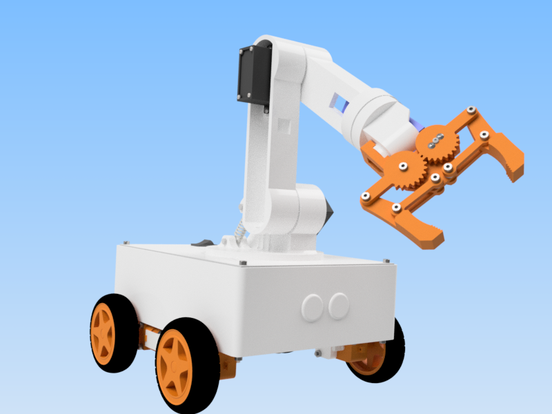

# OmObiArm: Bluetooth-Controlled Mobile Robot Arm with Arduino

This repository contains the resources, code, and documentation needed to build a Bluetooth-controlled mobile robot arm using an Arduino Mega, HC-05 Bluetooth module, and PCA9685 servo driver. This project combines robotics, mobile control, and app development to create a versatile and educational robot for beginners and enthusiasts.

## Features
- Wireless control of the robotic arm and mobile platform via Bluetooth.
- Six-axis robotic arm control with smooth servo movements.
- Mobile platform controlled through directional commands.
- Save and playback functionality for robotic arm poses.
- Intuitive Android app built with MIT App Inventor.

## Components
- **Motors and Wheels:** 4 DC motors with gearboxes and 4 wheels.
- **Electronics:** Arduino Mega, Adafruit Motor Shield V1.2, HC-05 Bluetooth module, PCA9685 servo driver, LM2596 DC-DC step-down module.
- **Servos:** 3 SG90 micro servos and 3 MG996R servos.
- **3D-Printed Parts:** Custom chassis and robotic arm components.
- **Accessories:** Jumper wires, screws, inserts, a LiPo battery, and a smartphone with the custom app installed.

## Arduino Code and App
- The Arduino code manages Bluetooth communication, motor control, and servo movements.
- The Android app allows intuitive control of the robotic arm and mobile platform via sliders, directional buttons, and pose-saving options.

## How to Use
1. **Build the Robot:**
   - Assemble the mobile chassis and robotic arm as described in the guide.
2. **Load the Code:**
   - Upload the Arduino code to the Arduino Mega.
3. **Install the App:**
   - Download and install the APK file on your Android device.
4. **Pair Your Device:**
   - Pair the HC-05 Bluetooth module with your smartphone.
5. **Control the Robot:**
   - Use the app to control the robot's movements and save or replay poses.

## Preview

*The OmObiArm: A Bluetooth-controlled mobile robot arm showcasing its gripping mechanism.*

---

## Resources
- **Blog Post:** [Building the OmObiArm: A Bluetooth-Controlled Mobile Robot Arm](https://omartronics.com/omobiarm-building-a-mobile-robot-with-an-integrated-robotic-arm-using-arduino-and-bluetooth-control-duplicate-2858/)
- **YouTube Video:** [OmObiArm - Step-by-Step Build Tutorial](https://youtu.be/KSroUz1tMO0)
- **STL Files:** [Download STL Files on Cults3D](https://cults3d.com/:2518381)
